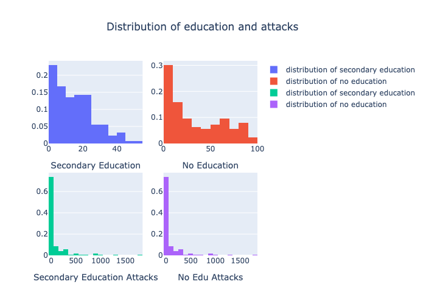

# Global Terrorism Analysis
  

### An analysis of global terrorism and its interaction with female education rates.
___
__Abstract:__
I collected all known global acts of terrorism from the National Consortium for the Study of Terrorism and Responses to Terrorism from the years between 1970 and 2018. This data was analysed to find trends and insight. After conducting inital EDA, I have combined the National Consortium's dataset with global education data to further my analysis. My primary question: does the education of women affect number of terroristic events?

__Results:__
After conducting an analysis, I have concluded the education of females is directly correlated to acts of terrorism. This trend holds for both percentage of women without education and for perentage of women which have completed secondary school. These metrics were selected as they give a variety of standards for education.
___
# Background & Motivation
Terrorism is a constant security threat around the world. With more insight into how terrorism works, governments can make better decisions in dealing with present threats both in-boarders and abroad. While typical approaches to terrorism involve target hardening, counter-intelligence and military intervention, I wondered what role education played education. Spesifically, the role of educating women.

My background is in psychotherapy, so I often look to more humanitarian based interventions to global conflict. If we can put a higher value to education and get reduced acts of terrorism, this would be a desireable approach. Education can be increased with policy changes and economic strategy.
___
## Terrorism and Education
How a country values and allocates education to women says a lot about the local politics, government structure and behaviors of a country. I combined terrorist dataset found on [http://gtd.terrorismdata.com](https://www.start.umd.edu/data-tools/global-terrorism-database-gtd) with world wide educational statistics found on [https://www.worldbank.org](https://datacatalog.worldbank.org/dataset/global-data-set-education-quality). Two two educational metrics I used were percent of women with no education and percent of women that have completed secondary education. These statistics are gathered globally in 5 year intervals from 1970 to 2010.

I selected these two metrics spesifically because they give two different stringency levels for education. No education is a seemingly low bar, while global rates of women that have completed secondary education is a signifcant goal. When this data was combined with terrorist events, the below correlations were found.

Each dot on these plots is a countries mean education from 1970 to 2010 correlated with a contries mean acts of terrorism from 1970 to 2010. The left most plot shows the correlation in women that have completed secondary education and acts of terror. It can be seen with a regression line, there does appear to be a pattern.

The left most plot is percentage of women with no education and acts of terrorism. The regression line also demonstrates as education increases, terrorism decreases. However after plotting this data, I am wondering what the skew is and what an appropriate metric for conducting a hypothesis test would be. Below this is explored.

It appears all education is right skewed. This indicates a non linear relationship and informs my selection of an appropriate correlational test. I select Spearman R for this reason.

* % women that have completed secondary education
* p-value: 0.0103

* % of women that have recieved no education
* p-value: 0.009

I can reject my null hypothesis and can safely conclude education does affect rates of terrorism.

___
## Limitations
It is important to note correlation does not  equal causation. Terrorism by its very nature is an ourlier event and each organization involved in commiting acts of terror have different ideologies and motivations. Each country is distinct from one another and have their own cultural issues. It would be valuable to evaluate each country individually and do research on the socioeconomic issues of each contry to gain more insight.
___
## Insights into Terrorism: A Post 9/11 World
In order to trend terrorism, I focused on events after 9/11. The Twin Tower terrorist attack was a moment of global change, in terms of politics, war, globalism, and the response to terrorism.

* Terrorism was on the rise in the 80's and 90's
* Acts of Terrorism had a significant spike in 2014
* Bombings and Armed Assault are the two primary terroristic threats

* Bombings and Armed Assult are the most successful means of attack

* Post 9/11 Iraq is the most contested country in the world by a significant margin 

* Iraq is not equipped at dealing with terrorism

* Terrorism is becoming less deadly with fewer killed and fewer injured
* This may indicate we are more capable at dealing with terrorism

___
## Future Research
A more costom approach to understanding terrorism is needed. Each country is different and each terrorist group has a different ideology. This study was more of a top down study and does not grasp the sheer complexity of such events.
___
